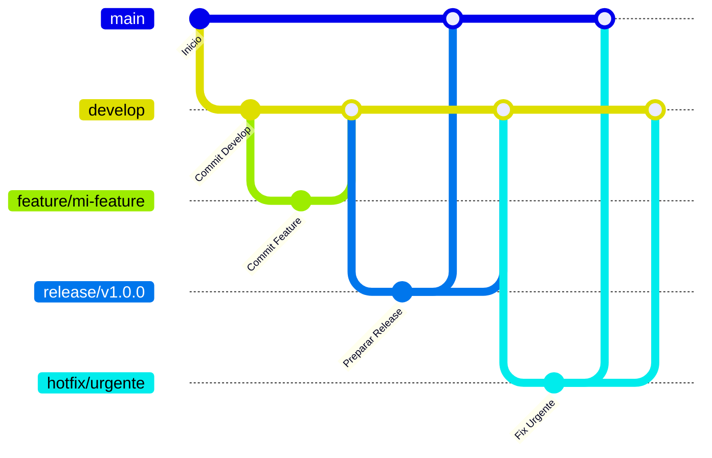

```mermaid
gitGraph
   commit id: "Inicio"
   branch develop
   checkout develop
   commit id: "Commit Develop"
   branch feature/mi-feature
   checkout feature/mi-feature
   commit id: "Commit Feature"
   checkout develop
   merge feature/mi-feature
   branch release/v1.0.0
   checkout release/v1.0.0
   commit id: "Preparar Release"
   checkout main
   merge release/v1.0.0
   checkout develop
   merge release/v1.0.0
   branch hotfix/urgente
   checkout hotfix/urgente
   commit id: "Fix Urgente"
   checkout main
   merge hotfix/urgente
   checkout develop
   merge hotfix/urgente
```
