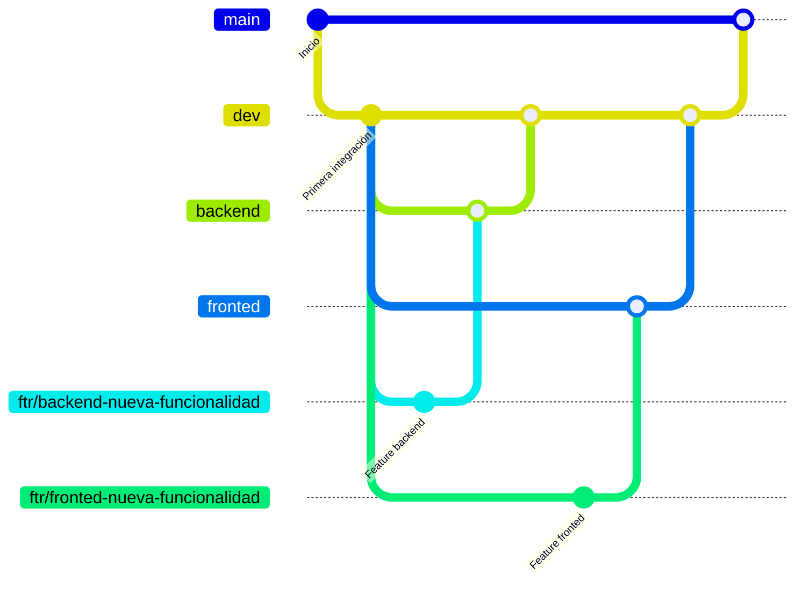

```mermaid
gitGraph
   commit id: "Inicio"
   branch dev
   checkout dev
   commit id: "Primera integración"
   branch backend
   branch fronted
   checkout backend
   branch ftr/backend-nueva-funcionalidad
   checkout ftr/backend-nueva-funcionalidad
   commit id: "Feature backend"
   checkout backend
   merge ftr/backend-nueva-funcionalidad
   checkout dev
   merge backend
   checkout fronted
   branch ftr/fronted-nueva-funcionalidad
   checkout ftr/fronted-nueva-funcionalidad
   commit id: "Feature fronted"
   checkout fronted
   merge ftr/fronted-nueva-funcionalidad
   checkout dev
   merge fronted
   checkout main
   merge dev
```
